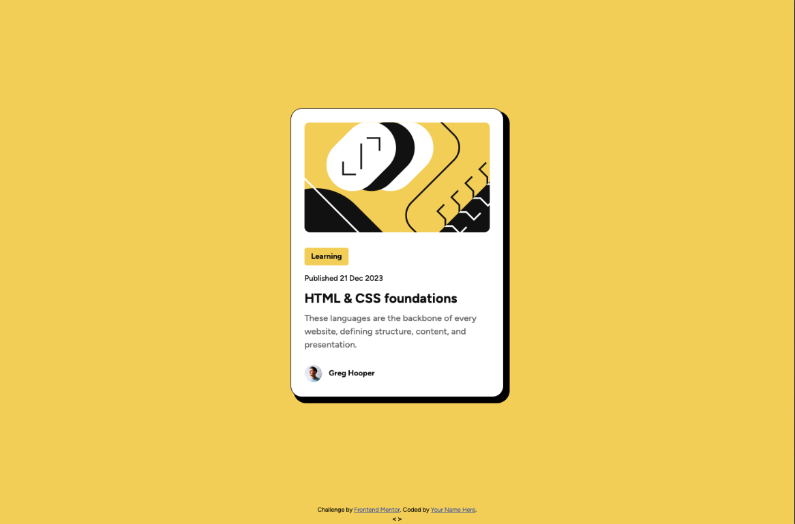
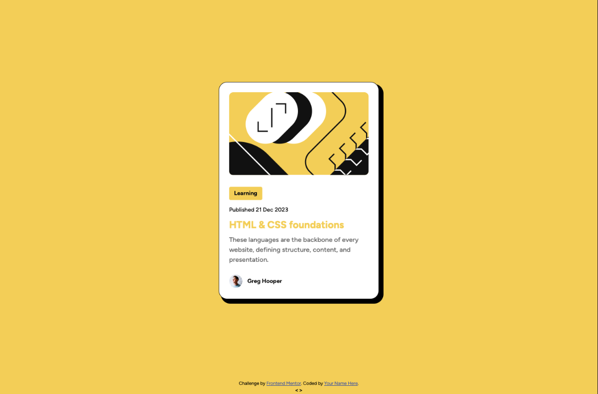

# Frontend Mentor - Blog preview card solution

This is a solution to the [Blog preview card challenge on Frontend Mentor](https://www.frontendmentor.io/challenges/blog-preview-card-ckPaj01IcS).

## Table of contents

- [Overview](#overview)
  - [The challenge](#the-challenge)
  - [Screenshot](#screenshot)
  - [Links](#links)
- [My process](#my-process)
  - [Built with](#built-with)
  - [What I learned](#what-i-learned)
  - [Continued development](#continued-development)
  - [Useful resources](#useful-resources)
- [Author](#author)


## Overview

### The challenge

Users should be able to:

- See hover and focus states for all interactive elements on the page

### Screenshot





### Links

- Solution URL: [Solution](https://github.com/Chavakn0/fem-ch2-blog-preview-card/blob/main/index.html)
- Live Site URL: [Live Site](https://chavakn0.github.io/fem-ch2-blog-preview-card/)

## My process

### Built with

- Semantic HTML5 markup
- CSS custom properties
- Flexbox


### What I learned

An extra part of this challenge was to do it without using "@media" and decided to try it.
There was a lot of research going on, and although by the end I learned about "@container", I stuck with using "clamp()".
I think part of the challenge was also to use variable fonts, and for that I used "@font-face" which was new to me.
Also learned about naming "<section>"s in order to help with the readability of the site.

```html
<section aria-labelledby="content" class="subcontainer">
```
```css
.text-preset1 {
      font-size: clamp(20px, 3vw, 24px); 
      font-weight: 800;
      margin: 12px 0px;
    }
```


### Continued development

I want to keep understanding what is the MVP for a website, and how can you simplify that.
Right now I'm sure my code is long and messy, so learning about simplicity and readability is a must.

### Useful resources

- [Web.dev](https://web.dev) - This has been my go to site for research since the beginning I'd say.
- [Mdn](https://developer.mozilla.org) - When I can't seem to find what I'm looking for, this site or W3Schools are of great help, also StackOverflow
- [ChatGPT](https://chatgpt.com) - This is my last resort when I can't seem to get my answer, or simply don't understand the concept.


## Author

- Website - [chavakno](https://github.com/Chavakn0)
- Frontend Mentor - [@Chavakn0](https://www.frontendmentor.io/profile/Chavakn0)

